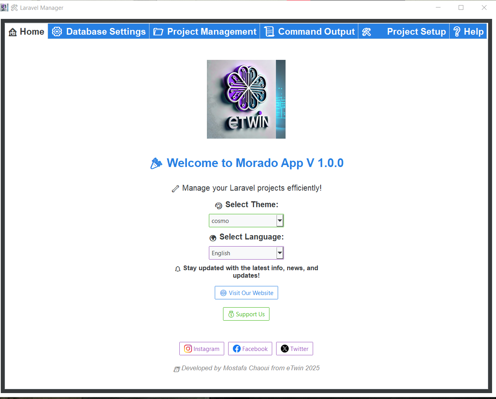
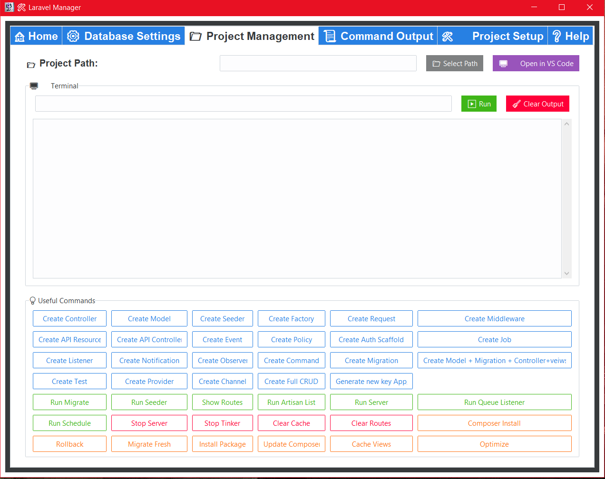
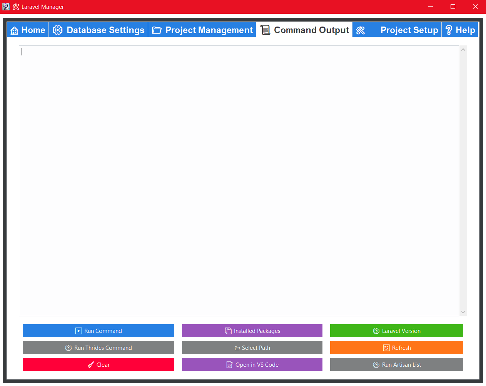
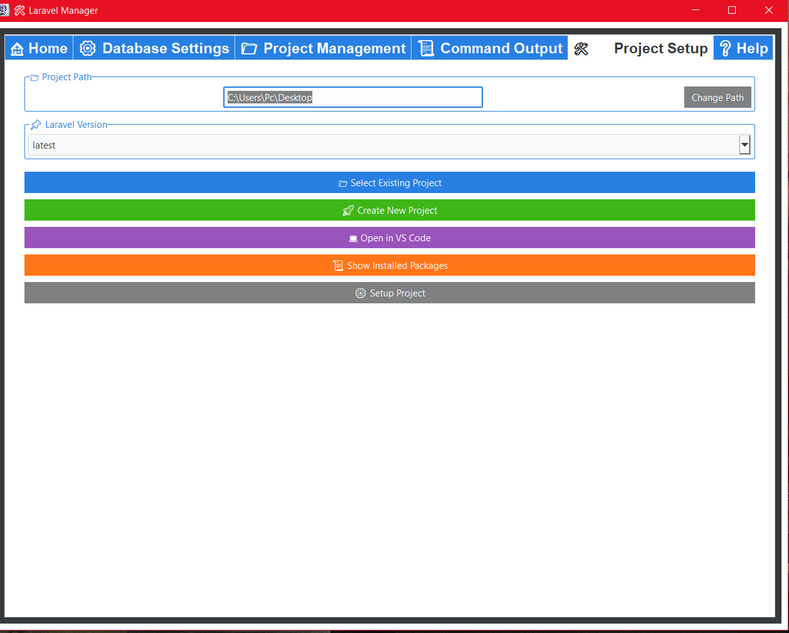
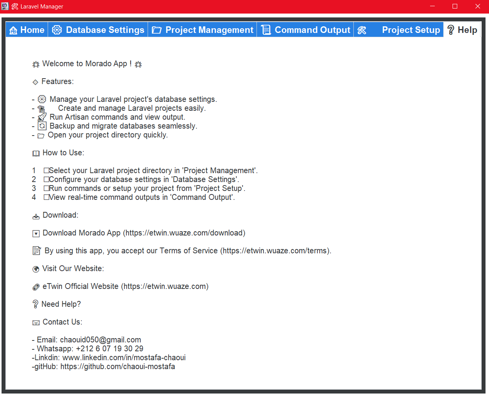

# 🚀 Laravel Manager   MORADO App V1

A simple yet powerful `.exe` desktop app to **manage your Laravel projects and databases** without using the terminal. Created to speed up development and make Laravel more accessible.

---

## 🧰 Features

- ⚡ **Create Laravel projects** in seconds
- 🗂️ **Open and manage existing projects**
- 🧱 **Generate models, controllers, and migrations**
- ⚙️ **Manage database settings** easily
- 🧪 **Run Artisan commands** with one click
- 🔐 **Edit .env file** through a user-friendly interface
- 💾 **Quick environment setup** and configuration
- 🎯 Built for speed, simplicity, and productivity

---

## 📸 Screenshots

### 🖥️ Home Interface  

### 📂 Project Manager and  Artisan Commands  

### ⚙️ Database Setup  

### 📚 Output Terminal

### 🔐 Setup Project Laravel

### 📦 Help and Contact us

 

---

## 🛠️ Built With

- 🐍 Python (Tkinter / PyQt / CustomTkinter, etc.)
- 💻 Laravel (for integration & testing)
- 🪟 Packaged as a Windows `.exe` application

---

## 👨‍💻 Developed By

**MOSTAFA CHAOUI**  
Passionate Full-Stack Developer 🇲🇦

---

## 📬 Contact

Feel free to reach out for suggestions or collaboration:  

📧 chaouid050@gmail.com  
 
🌐 [LinkedIn](https://www.linkedin.com/in/mostafa-chaoui/)  
🌐 [GitHub](https://github.com/chaoui-mostafa)  
🌐 [Twitter](https://twitter.com/chaoui_mostaf)  
🌐 [Instagram](https://www.instagram.com/chaoui_mostaf/)

website: [https://etwin.wuaze.com/](https://etwin.wuaze.com/)

---
Stay updated on my latest projects and developments by following me on social media and website.

